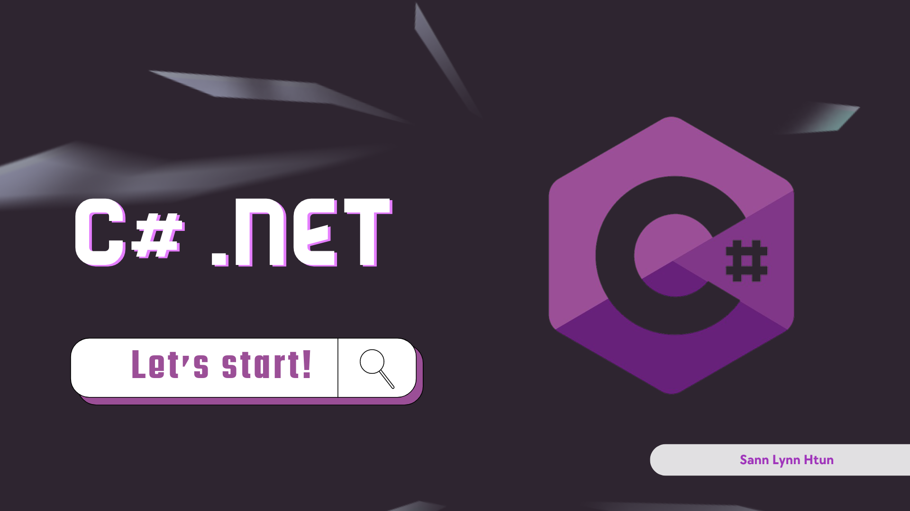

# [C# Course](https://github.com/sannlynnhtun-coding/csharp-course/wiki)

The C# programming language allows you to build many types of applications, like:

- Business applications to capture, analyze, and process data
- Dynamic web applications that can be accessed from a web browser
- Games, both 2D and 3D
- Financial and scientific applications
- Cloud-based applications
- Mobile applications

> Awesome Things You Can Build With C# https://youtu.be/_nd093DZC8Y

## Give a Star! :star:

If you like this repository to learn or start your solution, please give it a star. Thanks!

-----------------

.NET Training Batch 3 Telegram Channel (Free)
 
https://t.me/dot_net_training_batch_3

[You can see the course outline.](#batch-3-course-outline)

-----------------

.NET Training Batch 4 Telegram Channel (Free)
 
https://t.me/dot_net_training_batch_4

[You can see the course outline.](#batch-4-course-outline)

-----------------

| C# | .NET |
|----|------|
| C# is a programming language that is primarily used for building .NET applications. | .NET is a framework for building different kinds of programming applications. |
| Since it has similar syntax and concepts with Java, JavaScript, and it is easier to learn C#. | Open-source many languages (C#, F#, VB.NET), libraries, ecosystems with multiple platforms (Heroku, IBM Bluemix) are available for your use. |
| Being Microsoft products, benefit from extensive support from the MSDN community | It is harder to learn since it has a broad selection of various types of technologies to have as background and lots of community support. |
| Provides the syntax and rules for coding | Does not also have support from the MSDN community. It also provides the environment for executing applications written in C#, or other compatible languages |
| Used to develop cross-platform desktop, web frameworks, service application, and statement keyword. | It's a framework with an extensive library of pre-existing classes ready to be utilized right away. |
| In C#, the Common Language Runtime (CLR) ensures complete applications. | .NET framework includes runtime environment (CLR) and a class library that developers use as code libraries into their applications. |
| Supports multi-paradigm programming (OOP after encapsulation inheritance language including LEC & function). | This supports a wide range of programming paradigms, especially with its IL through the combination of compilation and interpretation processes. .NET uses Framework # emphasizing practicality in its programming languages like F# for building efficient programs within this structure system. |

## Course Outline
- [x] Console App

- [x] [ADO.NET (CRUD)](https://github.com/sannlynnhtun-coding/csharp-course/wiki/Console-App-using-ADO.NET)
- [x] [Dapper  (CRUD)](https://github.com/sannlynnhtun-coding/csharp-course/wiki/Console-App-using-Dapper)
- [x] [EF Core (CRUD) [Code First, Database First]](https://github.com/sannlynnhtun-coding/csharp-course/wiki/Console-App-using-EF-Core)
- [x] RepoDB

- [x] Postman
	- [x] GET, POST, PUT, PATCH, DELETE
	- [x] Export, Import, Use Variable in Postman
	
- [x] ASP.NET Core Web API (REST API / RESTful API)
    - [x] EF
    - [x] Dapper
    - [x] Ado.Net
    - [x] Minimal Api
    
- [x] Console App connect with ASP.NET Core Web API
    - [x] HttpClient
    - [x] RestClient
    - [x] Refit

- [x] [Burma Project Ideas](https://github.com/sannlynnhtun-coding/burma-project-ideas)
- [x] [One Project - One Month](https://github.com/sannlynnhtun-coding/one-project-one-month)

- [x] Html, Css, JavaScript, Bootstrap, jQuery
    - [x] Local Storage / Session Storage CRUD

- [x] jQuery Plugins
    - [x] [SweetAlert](https://sweetalert2.github.io/)
    - [x] [Notiflix (Notify, Report, Confirm, Loading, Block)](https://notiflix.github.io/)  
    - [x] [DataTable](https://datatables.net/) 
		- https://datatables.net/examples/index  
		- https://datatables.net/download/
    - [x] [Date Picker](https://fengyuanchen.github.io/datepicker/)  
		- https://github.com/fengyuanchen/datepicker/blob/master/README.md 
		- https://github.com/fengyuanchen/datepicker/releases/tag/v1.0.10
    - [x] [Ladda Button](https://msurguy.github.io/ladda-bootstrap/)
		- https://cdnjs.com/libraries/ladda-bootstrap  
		- https://github.com/msurguy/ladda-bootstrap
    - [x] [iCheckbox (Radio, CheckBox)](https://bantikyan.github.io/icheck-bootstrap/) 
		- https://cdnjs.com/libraries/icheck-bootstrap 
		- https://github.com/bantikyan/icheck-bootstrap 
		- https://penguin-arts.com/how-to-check-if-a-checkbox-is-checked-using-icheck-library/
    - [x] [Toast](https://apvarun.github.io/toastify-js)
		- https://github.com/apvarun/toastify-js/blob/master/README.md

- [x] ASP.NET Core MVC (submit, ajax)
    - [x] EF 
    - [x] Ado.Net
    - [x] Dapper
    
- [x] Charts
  - [x] ApexChart
  - [x] ChartJs
  - [x] HighCharts
  - [x] CanvasJS 

- [x] ASP.NET Core MVC [Frontend Only] with ASP.NET Core Web API using HttpClient, RestSharp, Refit
    - [x] HttpClient
    - [x] RestClient
    - [x] Refit

- [x] Logging (Serilog, NLog, Log4net)
    - [x] Text Logging
    - [x] Db Logging

- [x] SignalR (WebSocket)
    - [x] Realtime Chat App using SignalR 
    - [x] Realtime Chart using SignalR

- [x] UI Design

- [x] ASP.NET Core Blazor
    - [x] Blazor Web Assembly CRUD with ASP.NET Core Web API using HttpClient
    - [x] Blazor Server CRUD with EF Core

- [x] Publish and deploy the app
    - [x] Deploy Blazor Web Assembly
    - [x] Deploy on IIS
    - [x] Deploy .NET 8 ASP.NET Core Blazor Web Assembly on Vercel, Netlify

- [x] Middleware (ASP.NET Core MVC/API)

----------------------------

Self Study

- [x] [ASP.NET Core + GraphQL](https://github.com/sannlynnhtun-coding/SLHDotNetCore.GraphqlExample)
- [x] ASP.NET Core + gRPC
- [x] [C# Examples](https://github.com/sannlynnhtun-coding/csharp-examples)

----------------------------

## Batch 4 Course Outline

> 1. [Microsoft SQL Server Installation](https://docs.google.com/document/d/1RExSyOKaXB5hTbHZAz64tGJHv4cNz8ktvPcIn6iV298/edit?usp=sharing)
> 2. [Visual Studio 2022 Installation](https://docs.google.com/document/d/1EJUY9R0_s8BekTq_vN9N7OLmla71kSdG3AA7TTXkm6A/edit?usp=sharing)
> 3. [Visual Studio Code Installation](https://youtu.be/O4dCgYicoDg)
> 4. [JetBrains Rider Installation](https://t.me/dot_net_training_batch_4/108)
> 5. [SQL Basic](https://t.me/dot_net_training_batch_4/12)
> 6. [C# Basic](https://t.me/dot_net_training_batch_4/11)
> 7. [ADO.NET Read](https://t.me/dot_net_training_batch_4/22)
> 8. [ADO.NET Update, Delete, Edit](https://t.me/dot_net_training_batch_4/24)
> 9. [ADO.NET Create](https://t.me/dot_net_training_batch_4/26)
> 10. [Open with VS Code](https://t.me/dot_net_training_batch_4/25)
> 11. [Dapper CRUD](https://t.me/dot_net_training_batch_4/53)
> 12. [GitHub Public Setting](https://t.me/dot_net_training_batch_4/54)
> 13. [Database Export as Script](https://t.me/dot_net_training_batch_4/55)
> 14. [EF Core CRUD](https://t.me/dot_net_training_batch_4/56)
> 15. [Console App Folder Structure](https://t.me/dot_net_training_batch_4/57)
> 16. [ASP.NET Core Web API using EF Core CRUD](https://t.me/dot_net_training_batch_4/58)
> 17. [ASP.NET Core Web API using Dapper CRUD](https://t.me/dot_net_training_batch_4/59)
> 18. [ASP.NET Core Web API using ADO.NET CRUD](https://t.me/dot_net_training_batch_4/65)
> 19. [Dapper Custom Service](https://t.me/dot_net_training_batch_4/66)
> 20. [ADO.NET Custom Service](https://t.me/dot_net_training_batch_4/67)
> 21. [Layered (N-Layer) Architecture](https://t.me/dot_net_training_batch_4/73)
> 22. [Burma Project Idea Discussion For API](https://t.me/dot_net_training_batch_4/74)
> 23. [Burma Project Idea JSON data to API](https://t.me/dot_net_training_batch_4/75)
> 24. [Console App CRUD with API using HttpClient](https://t.me/dot_net_training_batch_4/76)
> 25. [Console App CRUD with API using RestClient](https://t.me/dot_net_training_batch_4/78)
> 26. [Myanmar Proverbs API](https://t.me/dot_net_training_batch_4/81)
> 27. [Pizza API](https://t.me/dot_net_training_batch_4/82)
> 28. [Pizza API using Query with Dapper Service](https://t.me/dot_net_training_batch_4/83)
> 29. [Console App CRUD with API using Refit](https://t.me/dot_net_training_batch_4/84)
> 30. [Windows Forms Intro](https://t.me/dot_net_training_batch_4/88)
> 31. [.NET Framework vs .NET Core vs .NET](https://t.me/dot_net_training_batch_4/89)
> 32. [Windows Forms - Hello World](https://t.me/dot_net_training_batch_4/90)
> 33. [Windows Forms Blog - Create](https://t.me/dot_net_training_batch_4/91)
> 34. [Windows Forms Blog - List](https://t.me/dot_net_training_batch_4/94)
> 35. [Windows Forms Blog - Edit, Delete](https://t.me/dot_net_training_batch_4/95)
> 36. [If Case, Switch Case](https://t.me/dot_net_training_batch_4/96)
> 37. [Sql Injection](https://t.me/dot_net_training_batch_4/97)
> 38. [NLayer Architecture](https://t.me/dot_net_training_batch_4/98)
> 39. [JavaScript Blog CRUD](https://t.me/dot_net_training_batch_4/99)
> 40. [Html + JavaScript Blog CRUD](https://t.me/dot_net_training_batch_4/100)
> 41. [jQuery Plugin (SweetAlert, Notiflix)](https://t.me/dot_net_training_batch_4/103)
> 42. [jQuery Plugins - DataTable, Date Picker, Ladda Button, iCheckbox, Custom Confirm Message](https://t.me/dot_net_training_batch_4/104)
> 43. [Dependency Injection](https://t.me/dot_net_training_batch_4/106)
> 44. [Dependency Injection - Code](https://t.me/dot_net_training_batch_4/107)
> 45. [ASP.NET Core Minimal API CRUD](https://t.me/dot_net_training_batch_4/109)
> 46. [ASP.NET Core Web MVC Blog List](https://t.me/dot_net_training_batch_4/110)
> 47. [ASP.NET Core Web MVC Blog Create](https://t.me/dot_net_training_batch_4/111)
> 48. [ASP.NET Core Web MVC Blog Edit Update Delete](https://t.me/dot_net_training_batch_4/112)
> 49. [AsNoTracking](https://t.me/dot_net_training_batch_4/113)
> 50. [ASP.NET Core MVC Ajax](https://t.me/dot_net_training_batch_4/115)
> 51. [ASP.NET Core Apex Chart - Pie Chart](https://t.me/dot_net_training_batch_4/116)
> 52. [ASP.NET Core Chart.js, HighCharts, CanvasJs, Text Log](https://t.me/dot_net_training_batch_4/117)
> 53. [Db Log Part - 1](https://t.me/dot_net_training_batch_4/118)
> 54. [Db Log Part - 2](https://t.me/dot_net_training_batch_4/119)
> 55. [Realtime Chat using SignalR Part - 1](https://t.me/dot_net_training_batch_4/120)
> 56. [Realtime Chat using SignalR Part - 2](https://t.me/dot_net_training_batch_4/121)
> 57. [Realtime Chart using SignalR](https://t.me/dot_net_training_batch_4/122)
> 58. [EF Core Database First](https://t.me/dot_net_training_batch_4/123)
> 59. [ASP.NET Core MVC + UI Design (Admin LTE)](https://t.me/dot_net_training_batch_4/124)
> 60. [Blazor Server, Blazor Web Assembly](https://t.me/dot_net_training_batch_4/125)
> 61. [About Blazor Web Assembly Project](https://t.me/dot_net_training_batch_4/126)
> 62. [ASP.NET Core MVC Ajax - V2](https://t.me/dot_net_training_batch_4/127)
> 63. [ASP.NET Core Blazor Web Assembly with API (GET, POST)](https://t.me/dot_net_training_batch_4/128)
> 64. [ASP.NET Core Blazor Web Assembly with API (GET, PUT, DELETE)](https://t.me/dot_net_training_batch_4/129)
> 65. [ASP.NET Core Blazor Web Assembly with API (GET By ID)](https://t.me/dot_net_training_batch_4/130)
> 66. [ASP.NET Core Blazor Server CRUD](https://t.me/dot_net_training_batch_4/131)
> 67. [Deploy ASP.NET Core](https://t.me/dot_net_training_batch_4/132)
> 68. [Session, Middleware](https://t.me/dot_net_training_batch_4/133)
> 69. [Blog Project](https://t.me/dot_net_training_batch_4/134)

----------------------------

## Batch 3 Course Outline

Visual Studio 2022 Installation
https://t.me/c/2105297398/59
https://docs.google.com/document/d/1EJUY9R0_s8BekTq_vN9N7OLmla71kSdG3AA7TTXkm6A/edit?usp=sharing

Microsoft SQL Server Installation
https://t.me/c/2105297398/60
https://docs.google.com/document/d/1RExSyOKaXB5hTbHZAz64tGJHv4cNz8ktvPcIn6iV298/edit?usp=sharing

C# Basic 
https://t.me/c/2105297398/117

SQL Basic
https://t.me/c/2105297398/118

Console App Intro & Push a project to GitHub
https://t.me/c/2105297398/5

C# Intro
https://t.me/c/2105297398/11

C# Console App CRUD using Ado.Net
https://t.me/c/2105297398/12

C# Console App CRUD using Dapper
https://t.me/c/2105297398/24

C# Console App CRUD using EFCore (Database First)
https://t.me/c/2105297398/25

ASP.NET Core Web API CRUD using EFCore
https://t.me/c/2105297398/28
https://t.me/c/2105297398/29

Postman & Console App CRUD using HttpClient Get / Read
https://t.me/c/2105297398/30

Console App CRUD using HttpClient Get / Post / Put / Delete
https://t.me/c/2105297398/33

Burma Project Ideas - Bird Project using ASP.NET Core Web API
https://t.me/c/2105297398/35

Console App CRUD using RestClient Get / Post / Put / Delete
https://t.me/c/2105297398/40

Console App CRUD using Refit Get / Post / Put / Delete
https://t.me/c/2105297398/41

Html, CSS, JavaScript, Bootstrap
https://t.me/c/2105297398/45

Local Storage CRUD
https://t.me/c/2105297398/56

Local Storage CRUD with Bootstrap UI
https://t.me/c/2105297398/58

jQuery Plugins 1
https://t.me/c/2105297398/61

jQuery Plugins 2
https://t.me/c/2105297398/64

ASP.NET Core MVC using EFCore Intro
https://t.me/c/2105297398/65

ASP.NET Core MVC CRUD using EF Core
https://t.me/c/2105297398/66

ASP.NET Core MVC Ajax CRUD, SweetAlert
https://t.me/c/2105297398/68

ASP.NET Core MVC with ApexChart
https://t.me/c/2105297398/71

ASP.NET Core MVC with ChartJs, HighCharts, CanvasJs
https://t.me/c/2105297398/72

ASP.NET Core Web API Pagination
https://t.me/c/2105297398/74

ASP.NET Core MVC Pagination
https://t.me/c/2105297398/75

Dependency Injection, AdoDotNet Service, Dapper Service
https://t.me/c/2105297398/77

Frontend (ASP.NET Core MVC) connect to Backend (ASP.NET Core Web API)
https://t.me/c/2105297398/79

Logging using Serilog (Text Log) in Console App, ASP.NET Core Web API
https://t.me/c/2105297398/80

Console App Logging using Serilog
https://t.me/c/2105297398/85

ASP.NET Core Web MVC / API Logging using Serilog
https://t.me/c/2105297398/86

ASP.NET Core MVC UI Design
https://t.me/c/2105297398/87

ASP.NET Core MVC Deploy to IIS
https://t.me/c/2105297398/88

ASP.NET Core MVC Realtime Chart App using SignalR
https://t.me/c/2105297398/89

ASP.NET Core MVC Realtime Chart App
https://t.me/c/2105297398/90

EFCore Database First Auto
https://t.me/c/2105297398/91

ASP.NET Core MVC Middleware
https://t.me/c/2105297398/92

ASP.NET Core Blazor Server CRUD
https://t.me/c/2105297398/93

ASP.NET Core MVC Login Middleware - 1
https://t.me/c/2105297398/97

ASP.NET Core MVC Login Middleware - 2
https://t.me/c/2105297398/98

ASP.NET Core MVC Login Middleware - 3
https://t.me/c/2105297398/99

ASP.NET Core Blazor Web Assembly Blog CRUD
https://t.me/c/2105297398/100

ASP.NET Core Blazor WASM with ASP.NET Core Web API
https://t.me/c/2105297398/101

Deploy ASP.NET Core Blazor Web Assembly
https://t.me/c/2105297398/102
  
