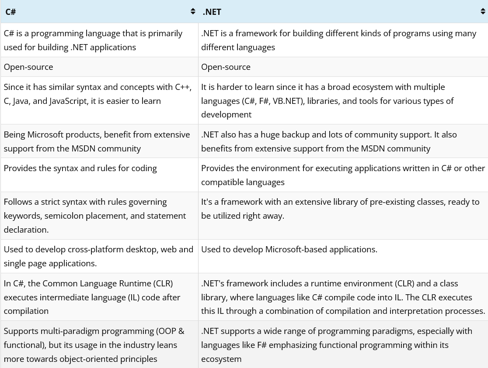

# [C# Course](https://github.com/sannlynnhtun-coding/csharp-course/wiki)
-----------------

.NET Training Batch 3 Telegram Channel (Free)
 
https://t.me/+SnO5wIMP8QRhYmZl

-----------------

.NET Training Batch 4 Telegram Channel (Free)
 
Coming soon...

-----------------

- [x] Console App

- [x] ADO.NET (CRUD)
- [x] Dapper  (CRUD)
- [x] EF Core (CRUD) [Code First, Database First]
- [x] RepoDB

- [x] Postman
	- [x] GET, POST, PUT, PATCH, DELETE
	- [x] Export, Import, Use Variable in Postman
	
- [x] ASP.NET Core Web API (REST API / RESTful API)
    - [x] EF
    - [x] Dapper
    - [x] Ado.Net
    - [x] Minimal Api
    
- [x] Console App connect with ASP.NET Core Web API
    - [x] HttpClient
    - [x] RestClient
    - [x] Refit

- [x] [Burma Project Ideas](https://github.com/sannlynnhtun-coding/burma-project-ideas)

- [x] Html, Css, JavaScript, Bootstrap, jQuery
    - [x] Local Storage / Session Storage CRUD

- [x] jQuery Plugins
    - [x] [SweetAlert](https://sweetalert2.github.io/)
    - [x] [Notiflix (Notify, Report, Confirm, Loading, Block)](https://notiflix.github.io/)  
    - [x] [DataTable](https://datatables.net/) 
		- https://datatables.net/examples/index  
		- https://datatables.net/download/
    - [x] [Date Picker](https://fengyuanchen.github.io/datepicker/)  
		- https://github.com/fengyuanchen/datepicker/blob/master/README.md 
		- https://github.com/fengyuanchen/datepicker/releases/tag/v1.0.10
    - [x] [Ladda Button](https://msurguy.github.io/ladda-bootstrap/)
		- https://cdnjs.com/libraries/ladda-bootstrap  
		- https://github.com/msurguy/ladda-bootstrap
    - [x] [iCheckbox (Radio, CheckBox)](https://bantikyan.github.io/icheck-bootstrap/) 
		- https://cdnjs.com/libraries/icheck-bootstrap 
		- https://github.com/bantikyan/icheck-bootstrap 
		- https://penguin-arts.com/how-to-check-if-a-checkbox-is-checked-using-icheck-library/
    - [x] [Toast](https://apvarun.github.io/toastify-js)
		- https://github.com/apvarun/toastify-js/blob/master/README.md

- [x] ASP.NET Core MVC (submit, ajax)
    - [x] EF 
    - [x] Ado.Net
    - [x] Dapper
    
- [x] Charts
  - [x] ApexChart
  - [x] ChartJs
  - [x] HighCharts
  - [x] CanvasJS 

- [x] ASP.NET Core MVC [Frontend Only] with ASP.NET Core Web API using HttpClient, RestSharp, Refit
    - [x] HttpClient
    - [x] RestClient
    - [x] Refit

- [x] Logging (Serilog, NLog, Log4net)
    - [x] Text Logging
    - [x] Db Logging

- [x] SignalR (WebSocket)
    - [x] Realtime Chat App using SignalR 
    - [x] Realtime Chart using SignalR

- [x] UI Design

- [x] ASP.NET Core Blazor
    - [x] Blazor Web Assembly CRUD with ASP.NET Core Web API using HttpClient
    - [x] Blazor Server CRUD with EF Core

- [x] Publish and deploy the app
    - [x] Deploy Blazor Web Assembly
    - [x] Deploy on IIS
    - [x] Deploy .NET 8 ASP.NET Core Blazor Web Assembly on Vercel, Netlify

- [x] Middleware (ASP.NET Core MVC/API)

- [x] ASP.NET Core + GraphQL
- [x] ASP.NET Core + gRPC

  
